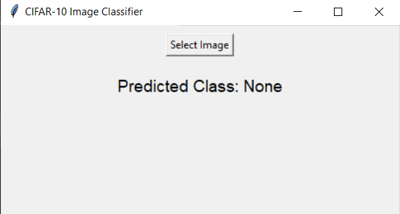
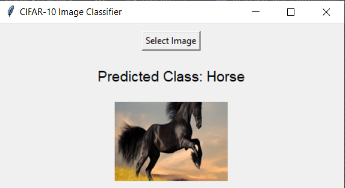

# CIFAR-10 Image Classifier

A simple Python project using **TensorFlow** and **Tkinter** to classify images into one of 10 classes from the CIFAR-10 dataset.

## Features

- **Dataset**: 10 classes (Airplane, Automobile, Bird, Cat, Deer, Dog, Frog, Horse, Ship, Truck).
- **Model**: A CNN with convolutional layers, pooling, and dense layers.
- **UI**: Upload an image via a Tkinter interface to classify it.

## Setup

1. Install dependencies:

   ```bash
   pip install tensorflow numpy pillow
   ```

2. Run the script:

   ```bash
   python script_name.py
   ```

## Example

Below is an example screenshot of the Tkinter interface:

 


---

